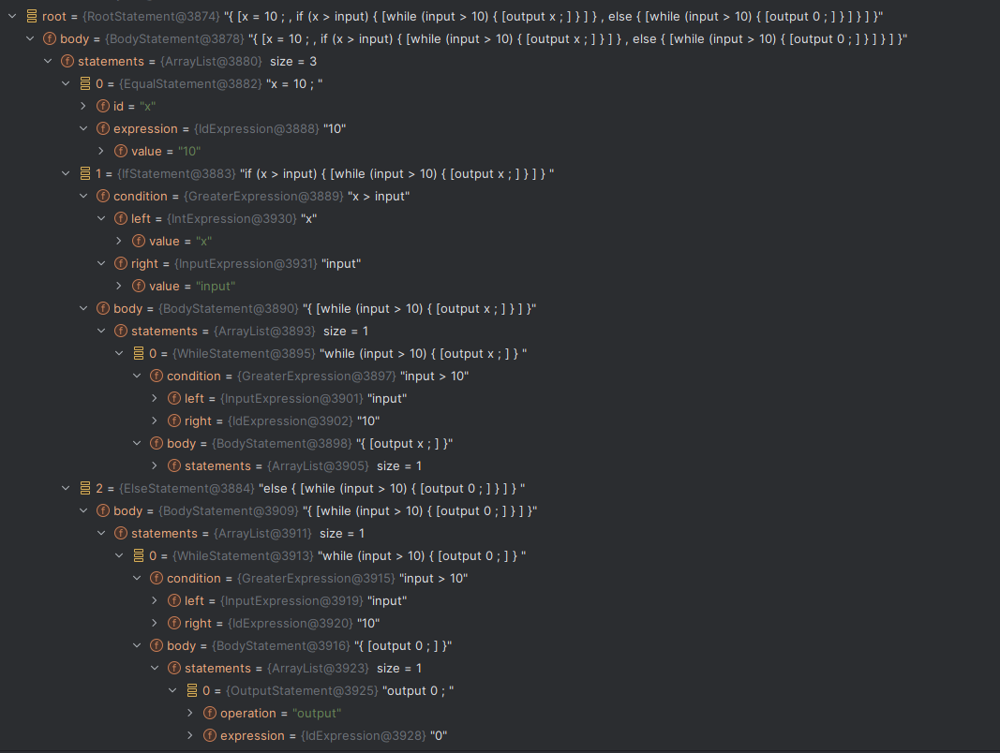

## Построение синтаксического дерева для языка TIP

##### Requirements:
- Java 21

##### Компиляция проекта и запуск
```
mvn compile package
```

```
java -jar tip-peg-parser-1.0.0-jar-with-dependencies.jar code.txt
```

В качества параметра запуска передается путь до файла с кодом.


##### Описание

Лексикографический парсер и построение дерева работает для языка TIP со следующей грамматикой:

```
Int -> 0 | 1 | -1 | 2 | -2 | ... 
Id -> x | y | z | ... 
Exp -> Int | Id | Exp + Exp | Exp - Exp | Exp * Exp | Exp / Exp | Exp > Exp | Exp == Exp | ( Exp ) | input
Stm → Id = Exp ; | output Exp ; | Stm Stm | if ( Exp ) { Stm } else { Stm } | while ( Exp ) { Stm }
```

Промежуточным результатом является объект класса `RootStatement`, который содержит в себе всю древовидную структуру исходных данных. Вокруг этого объекта можно менять репрезнентацию результирующего AST-дерева. 




##### Пример

---

_Input:_
```
x = 10;           
if (x > input) { 
    while (input > 10) {
        output x;
    }
} else {
    while (input > 10) {
        output 0;
    }
} 
```

_Output:_
```
root ↓
    x = 10
    if x > input is true ↓
        while input > 10 is true ↺
            output: x
    else ↓
        while input > 10 is true ↺
            output: 0
```
---

_Input:_
```
x = 10; if (x > 9) { output x; } else { output 0; }
```

_Output:_
```
root ↓
    x = 10
    if x > 9 is true ↓
        output: x
    else ↓
        output: 0
```
---
Другие примеры кода находятся в тестах проекта.
